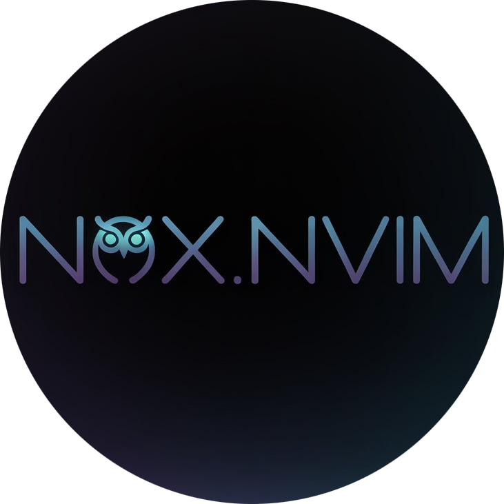

<div align="center">



**A modern Neovim colorscheme, designed specifically for C++ developement**

[](https://gitlab.com/codeomnium3/nox.nvim/-/blob/main/LICENSE)
[](https://neovim.io)
[](https://github.com/codeomnium-x/nox.nvim)
[](https://gitlab.com/codeomnium3/nox.nvim)

 [Installation](#-installation) • [Configuration](#%EF%B8%8F-configuration) • [Colors](#-color-palette) • [Plugins](#-supported-plugins)

</div>

## 📷 Screenshots

#### Dark


#### Umbra


#### Light


---

## 📦 Installation

### lazy.nvim (Recommended)

```lua
{
  "https://github.com/codeomnium-x/nox.nvim",
  lazy = false,
  priority = 1000,
  config = function()
    require("nox").setup()
    require("nox").load()
  end,
}
```

### packer.nvim

```lua
use {
  "https://github.com/codeomnium-x/nox.nvim",
  config = function()
    require("nox").setup()
    require("nox").load()
  end
}
```

### vim-plug

```vim
Plug 'https://github.com/codeomnium-xnox.nvim'
```

Then add to your `init.vim` or `init.lua`:
```vim
colorscheme nox
```

---

## ⚙️ Configuration

<details>
<summary><b>🚀 Quick Setup</b></summary>

```lua
-- Minimal setup - just activate the colorscheme
require("nox").setup()
require("nox").load()
```

</details>

<details>
<summary><b>🔧 Configuration</b></summary>

```lua
require("nox").setup({
  theme = "dark",              -- "dark", "light", or "umbra"
  transparent = false,         -- Enable transparent background
  terminal_colors = true,      -- Configure terminal colors
  dim_inactive = false,        -- Dim inactive windows

  -- Style customizations for different syntax groups
  styles = {
    comments = { italic = true },     -- Italic comments(default)
    conditionals = {},                -- if, else, switch statements
    loops = {},                       -- for, while, do loops
    functions = {},                   -- Function names and calls
    keywords = {},                    -- Language keywords
    strings = {},                     -- String literals
    variables = {},                   -- Variable names
    numbers = {},                     -- Numeric literals
    booleans = {},                    -- true, false values
    properties = {},                  -- Object properties
    types = {},                       -- Type names and declarations
  },
})

-- Apply the colorscheme
require("nox").load()
```

### Theme Switching

```lua
-- Switch to light theme
require("nox").setup({ theme = "light" })
require("nox").load()

-- Switch to dark theme
require("nox").setup({ theme = "dark" })
require("nox").load()

-- Switch to umbra theme (warm dark)
require("nox").setup({ theme = "umbra" })
require("nox").load()
```

</details>

---

## 🎨 Color Palette

<details>
<summary><b>🌙 Dark Theme Colors</b></summary>

### Base Colors
| Color | Hex | Usage |
|-------|-----|-------|
| **Background** | `#0d1117` | Main editor background |
| **Panel** | `#161b22` | Sidebar, panels |
| **Element** | `#21262d` | Floating elements |
| **Text** | `#eeeeee` | Primary text |
| **Text Muted** | `#808080` | Secondary text |

### Semantic Colors
| Color | Hex | Usage |
|-------|-----|-------|
| **Primary** | `#fab283` | Main accent |
| **Secondary** | `#5c9cf5` | Blue accent |
| **Accent** | `#9d7cd8` | Purple accent |
| **Error** | `#e06c75` | Error states |
| **Warning** | `#e5c07b` | Warning states |
| **Success** | `#7fd88f` | Success states |
| **Info** | `#56b6c2` | Information states |

### Syntax Colors
| Element | Hex | Usage |
|---------|-----|-------|
| **Keywords** | `#9d7cd8` | Language keywords |
| **Functions** | `#fab283` | Function names |
| **Strings** | `#7fd88f` | String literals |
| **Numbers** | `#e5c07b` | Numeric literals |
| **Comments** | `#808080` | Code comments |
| **Types** | `#e5c07b` | Type definitions |

</details>

<details>
<summary><b>☀️ Light Theme Colors</b></summary>

### Base Colors
| Color | Hex | Usage |
|-------|-----|-------|
| **Background** | `#fefefe` | Main editor background |
| **Panel** | `#f8f9fa` | Sidebar, panels |
| **Element** | `#f1f3f4` | Floating elements |
| **Text** | `#1a1a1a` | Primary text |
| **Text Muted** | `#8a8a8a` | Secondary text |

### Semantic Colors
| Color | Hex | Usage |
|-------|-----|-------|
| **Primary** | `#3b7dd8` | Main accent |
| **Secondary** | `#7b5bb6` | Purple accent |
| **Accent** | `#d68c27` | Orange accent |
| **Error** | `#d73a49` | Error states |
| **Warning** | `#b0851f` | Warning states |
| **Success** | `#3d9a57` | Success states |
| **Info** | `#0969da` | Information states |

### Syntax Colors
| Element | Hex | Usage |
|---------|-----|-------|
| **Keywords** | `#d68c27` | Language keywords |
| **Functions** | `#3b7dd8` | Function names |
| **Strings** | `#3d9a57` | String literals |
| **Numbers** | `#b0851f` | Numeric literals |
| **Comments** | `#8a8a8a` | Code comments |
| **Types** | `#b0851f` | Type definitions |

</details>

<details>
<summary><b>🌅 Umbra Theme Colors</b></summary>

### Base Colors
| Color | Hex | Usage |
|-------|-----|-------|
| **Background** | `#1a1612` | Main editor background |
| **Panel** | `#252017` | Sidebar, panels |
| **Element** | `#2f2a1f` | Floating elements |
| **Text** | `#f0ebe1` | Primary text |
| **Text Muted** | `#8a7f6f` | Secondary text |

### Semantic Colors
| Color | Hex | Usage |
|-------|-----|-------|
| **Primary** | `#fab283` | Main accent |
| **Secondary** | `#5c9cf5` | Blue accent |
| **Accent** | `#9d7cd8` | Purple accent |
| **Error** | `#e06c75` | Error states |
| **Warning** | `#f5a742` | Warning states |
| **Success** | `#7fd88f` | Success states |
| **Info** | `#56b6c2` | Information states |

### Syntax Colors
| Element | Hex | Usage |
|---------|-----|-------|
| **Keywords** | `#9d7cd8` | Language keywords |
| **Functions** | `#fab283` | Function names |
| **Strings** | `#7fd88f` | String literals |
| **Numbers** | `#f5a742` | Numeric literals |
| **Comments** | `#8a7f6f` | Code comments |
| **Types** | `#e5c07b` | Type definitions |

</details>

---

## 🔌 Supported Plugins

Nox.nvim provides consistent theming for the following popular Neovim plugins:

<details>
<summary><b>🎨 UI & Interface</b></summary>

- **[bufferline.nvim](https://github.com/akinsho/bufferline.nvim)**
- **[lualine.nvim](https://github.com/nvim-lualine/lualine.nvim)**
- **[noice.nvim](https://github.com/folke/noice.nvim)**
- **[trouble.nvim](https://github.com/folke/trouble.nvim)**

</details>

<details>
<summary><b>✏️ Editing & Navigation</b></summary>

- **[flash.nvim](https://github.com/folke/flash.nvim)**
- **[which-key.nvim](https://github.com/folke/which-key.nvim)**

</details>

<details>
<summary><b>🌳 Language Support</b></summary>

- **[nvim-treesitter](https://github.com/nvim-treesitter/nvim-treesitter)**
- **[nvim-treesitter](https://github.com/nvim-treesitter/nvim-treesitter)**
- **[nvim-lspconfig](https://github.com/neovim/nvim-lspconfig)**

</details>

<details>
<summary><b>💡 Completion & Snippets</b></summary>

- **[blink.cmp](https://github.com/saghen/blink.cmp)**

</details>

<details>
<summary><b>🔧 Development Tools</b></summary>

- **[gitsigns.nvim](https://github.com/lewis6991/gitsigns.nvim)**

</details>

<details>
<summary><b>🛠️ Utilities</b></summary>

- **[todo-comments.nvim](https://github.com/folke/todo-comments.nvim)**

</details>

---

## 🚀 Extras

<details>
<summary><b>🎨 Palette Access</b></summary>

Access the color palette programmatically for custom highlighting:

```lua
-- Get the current theme's color palette
local nox = require("nox")
local palette = require("nox.palette")

-- Get colors for the current theme
local colors = palette.get_colors(nox.config.theme)

-- Use colors in your own highlight groups
vim.api.nvim_set_hl(0, "MyCustomGroup", {
  fg = colors.primary,
  bg = colors.background,
  bold = true
})

-- Access raw theme base colors (modular structure)
local dark_palette = require("nox.palettes.dark")
local light_palette = require("nox.palettes.light")

-- Available color categories:
-- colors.primary, colors.secondary, colors.accent
-- colors.error, colors.warning, colors.success, colors.info
-- colors.text, colors.textMuted
-- colors.background, colors.backgroundPanel, colors.backgroundElement
-- colors.keyword, colors.function, colors.string, colors.number, etc.
```

</details>

<details>
<summary><b>🎨 Custom Highlight Overrides</b></summary>

Fine‑tune the look to your preference by overriding specific highlight groups.

Recommended: apply overrides after Nox has loaded, so your changes take precedence over the theme defaults.

### Step‑by‑step

```lua
-- 1) Load Nox
require("nox").setup({
  -- your configuration
})
require("nox").load()

-- 2) Get the palette for consistent colors (recommended)
local colors = require("nox.palette").get_colors(require("nox").config.theme)

-- 3) Apply your overrides (after load)
vim.api.nvim_set_hl(0, "Comment", { fg = colors.fg_alt, italic = false })
```

Tip: If you switch themes at runtime, use an autocmd so your overrides are re‑applied:

```lua
vim.api.nvim_create_autocmd("ColorScheme", {
  pattern = "nox",
  callback = function()
    local colors = require("nox.palette").get_colors(require("nox").config.theme)
    -- re-apply your overrides here
    vim.api.nvim_set_hl(0, "Comment", { fg = colors.fg_alt, italic = false })
  end,
})
```

See also: the Palette Access section above for details on retrieving colors.

### Basic override syntax

```lua
-- vim.api.nvim_set_hl(namespace, group, opts)
-- namespace: 0 for global
-- group: highlight group name (e.g., "Comment")
-- opts: { fg = "#RRGGBB" | colors.name, bg = ..., bold = true, italic = true, underline = true, undercurl = true }
vim.api.nvim_set_hl(0, "GroupName", { fg = colors.accent, bg = colors.bg_element, bold = true })
```

### Common customizations

- Make comments more/less prominent
```lua
-- More subtle comments
vim.api.nvim_set_hl(0, "Comment", { fg = colors.fg_alt, italic = true })

-- More prominent comments
vim.api.nvim_set_hl(0, "Comment", { fg = colors.fg, italic = false })
```

- Cursor and caret emphasis
```lua
vim.api.nvim_set_hl(0, "Cursor",       { fg = colors.bg, bg = colors.accent })
vim.api.nvim_set_hl(0, "CursorLine",   { bg = colors.bg_element })
vim.api.nvim_set_hl(0, "CursorColumn", { bg = colors.bg_element })
vim.api.nvim_set_hl(0, "CursorLineNr", { fg = colors.accent, bold = true })
```

- Search highlighting
```lua
vim.api.nvim_set_hl(0, "Search",    { fg = colors.bg, bg = colors.yellow, bold = true })
vim.api.nvim_set_hl(0, "IncSearch", { fg = colors.bg, bg = colors.orange, bold = true })
vim.api.nvim_set_hl(0, "CurSearch", { fg = colors.bg, bg = colors.orange, bold = true })
```

- Line numbers and gutter
```lua
vim.api.nvim_set_hl(0, "LineNr",     { fg = "#3c3c3c" })
vim.api.nvim_set_hl(0, "SignColumn", { fg = colors.fg_alt, bg = colors.bg })
```

### Using Nox palette for consistency

Keep your overrides cohesive by using Nox’s palette keys (see Palette Access):

```lua
local colors = require("nox.palette").get_colors(require("nox").config.theme)

vim.api.nvim_set_hl(0, "MyTitle", { fg = colors.primary, bg = colors.bg_alt, bold = true })
vim.api.nvim_set_hl(0, "MyNote",  { fg = colors.info,    bg = colors.bg_element, italic = true })
```

### Plugin‑specific overrides

You can override any plugin highlight group the same way:

```lua
-- Gitsigns
gvim = vim  -- only if your linter complains about global vim
vim.api.nvim_set_hl(0, "GitSignsAdd",    { fg = colors.green })
vim.api.nvim_set_hl(0, "GitSignsChange", { fg = colors.orange })
vim.api.nvim_set_hl(0, "GitSignsDelete", { fg = colors.red })

-- bufferline.nvim
vim.api.nvim_set_hl(0, "BufferLineFill",           { bg = colors.bg_element })
vim.api.nvim_set_hl(0, "BufferLineBufferSelected", { fg = colors.fg, bg = colors.bg, bold = true })

-- blink.cmp
vim.api.nvim_set_hl(0, "BlinkCmpMenuSelection", { fg = colors.bg, bg = colors.accent, bold = true })

-- which-key.nvim
vim.api.nvim_set_hl(0, "WhichKey",         { fg = colors.accent })
vim.api.nvim_set_hl(0, "WhichKeySeparator",{ fg = colors.fg_alt })
```

### Recommended

- Apply overrides after `require("nox").load()` or in a `ColorScheme` autocmd for persistence
- Prefer using Nox’s palette values (`colors.*`) over hard‑coded hex for a cohesive look

</details>


<details>
<summary><b>🔧 Custom Highlight Groups</b></summary>

Create custom highlight groups that integrate with the theme:

```lua
require("nox").setup({
  -- Your configuration
})

-- Define custom highlights after setup
require("nox").load()

-- Custom highlight examples
local colors = require("nox.palette").get_colors("dark") -- or "light"

vim.api.nvim_set_hl(0, "MyImportantComment", {
  fg = colors.warning,
  bg = colors.bg_element,
  italic = true,
  bold = true
})

vim.api.nvim_set_hl(0, "MyCodeBlock", {
  fg = colors.fg,
  bg = colors.bg_alt,
})
```

</details>

---

## 🔧 Troubleshooting

<details>
<summary><b>❓ Common Issues</b></summary>

### Colors look wrong or washed out

**Solution**: Ensure your terminal supports true colors:

```lua
-- Add to your init.lua
vim.o.termguicolors = true
```

For terminal emulators, check that 24-bit color support is enabled.

### Theme doesn't load properly

**Solution**: Make sure Nox is loaded with high priority:

```lua
{
  "https://gitlab.com/codeomnium3/nox.nvim",
  priority = 1000,  -- Load before other plugins
  lazy = false,     -- Don't lazy load colorschemes
}
```

### Plugin highlights are missing

**Solution**: Load Nox before other UI plugins:

```lua
-- In your plugin manager, ensure nox loads first
{
  "https://gitlab.com/codeomnium3/nox.nvim",
  priority = 1000,
  config = function()
    require("nox").setup()
    require("nox").load()
  end,
},
{
  "other-ui-plugin",
  dependencies = { "https://gitlab.com/codeomnium3/nox.nvim" },
}
```

### Transparent background not working

**Solution**: Enable transparency in your terminal and Nox config:

```lua
require("nox").setup({
  transparent = true,
})
```

Also ensure your terminal emulator supports transparency.

</details>

<details>
<summary><b>🐛 Reporting Issues</b></summary>

When reporting issues, please include:

1. **Neovim version**: `nvim --version`
2. **Terminal emulator** and version
3. **Plugin manager** (lazy.nvim, packer, etc.)
4. **Minimal config** that reproduces the issue
5. **Screenshots** if it's a visual issue

[Report issues on GitLab](https://gitlab.com/codeomnium3/nox.nvim/-/issues)

</details>

---

## 🤝 Contributing

We welcome contributions to make Nox.nvim even better! Here's how you can help:

<details>
<summary><b>🐛 Bug Reports</b></summary>

- Use the [issue tracker](https://gitlab.com/codeomnium3/nox.nvim/-/issues) to report bugs
- Include your Neovim version, terminal, and configuration
- Provide steps to reproduce the issue
- Add screenshots for visual issues

</details>

<details>
<summary><b>💡 Feature Requests</b></summary>

- Suggest new features or improvements via [issues](https://gitlab.com/codeomnium3/nox.nvim/-/issues)
- Explain the use case and expected behavior
- Consider contributing the implementation!

</details>

<details>
<summary><b>🔧 Development</b></summary>

### Getting Started

1. **Fork** the repository on GitLab
2. **Clone** your fork locally:
   ```bash
   git clone https://github.com/yourusername/nox.nvim.git
   cd nox.nvim
   ```

3. **Create** a feature branch:
   ```bash
   git checkout -b feature/amazing-feature
   ```

4. **Make** your changes and test thoroughly
5. **Commit** with clear messages:
   ```bash
   git commit -m 'feat: add amazing feature'
   ```

6. **Push** to your branch:
   ```bash
   git push origin feature/amazing-feature
   ```

7. **Open** a Merge Request

</details>

<details>
<summary><b>📝 Documentation</b></summary>

- Help improve documentation and examples
- Fix typos or unclear explanations
- Add usage examples for specific plugins
- Translate documentation (future)

</details>

<details>
<summary><b>🎨 Plugin Support</b></summary>

Adding support for a new plugin:

1. **Identify** the plugin's highlight groups
2. **Add** highlight definitions in [`lua/nox/groups/integrations/init.lua`](lua/nox/groups/integrations/init.lua)
3. **Test** the integration thoroughly
4. **Update** the plugin list in README.md
5. **Submit** a merge request

Example:
```lua
-- In lua/nox/groups/integrations/init.lua
function M.setup(colors, config)
  -- Add your plugin highlights here
  highlight("YourPluginHighlight", {
    fg = colors.primary,
    bg = colors.background
  })
end
```

</details>

---

## 📄 License

**MIT License** - see [LICENSE](https://github.com/codeomnium-x/nox.nvim/blob/main/LICENSE) for details.

## 🙏 Acknowledgments

- **OpenCode Theme** - Original inspiration for the color palette
- **Neovim Community** - For creating an amazing editor ecosystem
- **Plugin Authors** - For building the tools that make development enjoyable
- **Contributors** - Everyone who helps improve Nox.nvim

---

<div align="center">

**Made with ❤️ for the Neovim community**

[⭐ Star on GitLab](https://github.com/codeomnium-xomnium-x/nox.nvim) • [🐛 Report Issues](https://github.com/codeomnium-x/nox.nvim/issues) • [🤝 Contribute](https://github.com/codeomnium-x/nox.nvim/pulls)

**Repository**: [https://github.com/codeomnium-x/nox.nvim](https://github.com/codeomnium-x/nox.nvim)

</div>
